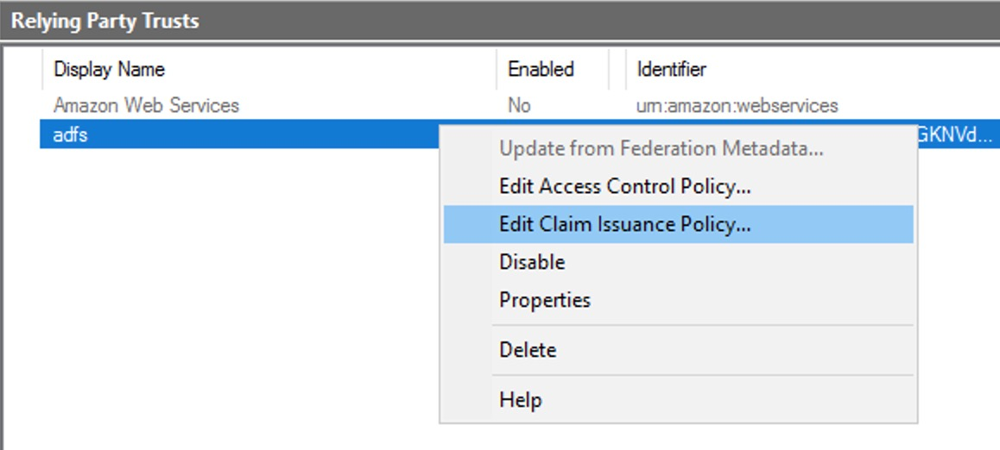

# Overview

使用Microsoft AD 目录，通过AWS Cognito认证接入Web Service的认证流程如下图所示，我们的安装步骤将按照这个顺序依次进行：


# Install && Config

## 1. 安装AD和ADFS

在AWS EC2中启动Windows_Server-2012-R2实例。之后使用远程桌面登录该实例并安装AD/ADFS服务。

详细安装过程请参考[视屏](https://www.youtube.com/watch?v=yagCgNvl3vs)

## 2. 创建Amazon Cognito User Pool

1. 登录 [Amazon Cognito console](https://console.aws.amazon.com/cognito/home)

2. 选择创建User Pool，出入pool名字(ad-test)，点击逐步介绍设置

    

3. 属性

    

4. 策略

    

5. 设备

    

6. 添加应用客户端

    

7. 审核并创建Pool

    


8. 在*应用程序继承->域名* 设置Cognito域名

    

## 3. 配置ADFS并导出SAML文件

1. 启动Relying Party Trusts向导

    

2. 配置Relying Party Trusts

    - 

    - *Select Data Source* 选择 *Enter data about the relying party manually*

    - *Specify Dsplay Name* 输入名字，这里我们输入**adfs**

    - 跳过证书设置

    - *Confgiure URL* 选择 *Enable support for the SAML 2.0 WebSSO protocol*, 并绑定Cognito user Pool的终端节点URL，即https://procept-omegaaibi3.auth.us-west-2.amazoncognito.com/saml2/idpresponse。(User Pool的域名已在步骤**2-9**中设置)

        

    - *Configure Identifiers* 添加Cognito user pool URN，即urn:amazon:cognito:sp:us-west-2_GKNVdphre。(User pool ID为us-west-2_GKNVdphre，可在User pool常规设置中查看)

        

        

    - *Choose Access Control Policy* 选择 *Permit everyone*

    - Finish configure

3. Edit Claim Issuance Policy

    

    

    

4. 在浏览器中输入https://localhost/FederationMetadata/2007-06/FederationMetadata.xml，保存文件为saml.xml


## 4. 在Amazon Cognito User Pool中导入saml文件

1. 在*联合身份验证->身份提供商*中上传adfs.xml

    

2. 在*联合身份验证->属性映射* 添加
    * SAML属性: http://schemas.xmlsoap.org/ws/2005/05/identity/claims/emailaddress
    * User Pool 属性: email

    

## 5. 部署web app

1. 下载测试需要使用的APP项目: 
    ```
    git clone git@github.com:leodrak/ADFSCognito.git
    ```

2. 使用prerequisites.yaml模板在AWS CloudFormation中创建Stack，等待实例创建完成

    - 将模板中nodejs6.10改为nodejs8.10

    - 创建堆栈，设置BucketName为datamanager-adfssso-test

    - 查看输出

        


3. 进入API Gateway配置页面

    - 添加授权方，将之前创建的Cognito User Pool于Gateway关联

        

    - 配置API接口的认证方式

        

4. 更新Cognito(ad-test)的配置
    - 在回调URL项中填入CloudfrontEndpoint的URL地址

        

5. 更新客户端App配置并上传到s3

    - vim ADFSCognito/DataManager/js/config.js

        

    - 上传文件到S3的datamanager-adfssso-test中

        


## 6. 测试

1. 在活动目录中新增测试用户(user: t1@procept.omega, pwd: test1234)

    

    

2. 在DynamoDB的ADFSSecretData表中插入数据

    

3. 修改ListSecretData的lambda函数，cognito将ADFS返回的认证信息存入headers.Authorization中，所以需要在lambda函数中解析。

    ```js
    const AWS = require('aws-sdk');
    const ddb = new AWS.DynamoDB.DocumentClient();
    exports.handler = (event, context, callback) => {

        console.log('Received event: ', event);
        var adfsResponse = event.headers.Authorization.split('.')[1];
        var adfsResponseDecoded = new Buffer(adfsResponse, 'base64').toString("ascii");
        var adfsData = JSON.parse(adfsResponseDecoded);

        listSecrets(adfsData.email).then((data) => {
            // You can use the callback function to provide a return value from your Node.js
            // Lambda functions. The first parameter is used for failed invocations. The
            // second parameter specifies the result data of the invocation.

            // Because this Lambda function is called by an API Gateway proxy integration
            // the result object must use the following structure.
            callback(null, {
                statusCode: 200,
                body: JSON.stringify(data.Items),
                headers: {
                    'Access-Control-Allow-Origin': '*',
                },
            });
        }).catch((err) => {
            console.error(err);

            // If there is an error during processing, catch it and return
            // from the Lambda function successfully. Specify a 500 HTTP status
            // code and provide an error message in the body. This will provide a
            // more meaningful error response to the end client.
            errorResponse(err.message, context.awsRequestId, callback)
        });
    };
    function listSecrets(username) {
        return ddb.scan({
            ExpressionAttributeValues: {
                ":u": username
            },
            FilterExpression: 'email = :u',
            TableName: 'ADFSSecretData',
        }).promise();
    }
    function errorResponse(errorMessage, awsRequestId, callback) {
      callback(null, {
        statusCode: 500,
        body: JSON.stringify({
          Error: errorMessage,
          Reference: awsRequestId,
        }),
        headers: {
          'Access-Control-Allow-Origin': '*',
        },
      });
    }
    ```

4. 使用AD上的用户，通过Cognito验证后登录后端App，完成测试
    - 访问https://d2d65txfu5q0vq.cloudfront.net, 将自动重定向到cognito，之后通过ADFS进行用户身份认证

    

    

    


