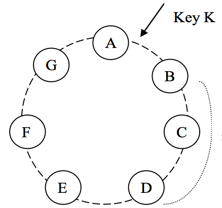

> http://docs.basho.com/riak/kv/2.2.3/learn/dynamo/

一个需要在生产环境中操作的存储系统的架构是非常复杂的。再加上数据持久化组件，系统需要具备扩展性和健壮性的负载均衡解决方案：成员和故障检测，故障恢复，同步复制，过载处理，状态转换，并发性和作业调度，请求编组，请求路由，系统监控和告警，配置管理。这里我们主要讨论Dynamo系统中核心的分布式技术：分区、复制、版本控制、成员、错误处理和扩展。

| 问题           |   使用技术           | 好处       |
|:-------------- |:-------------------:|:----------:|
| 分区           | 一致性hash           | 增加扩展性  |
| 写操作高可用    | 在读时使用向量时钟解决冲突 | 版本大小与更新速率解耦 |
| 解决临时错误    | 仲裁和隐士切换        | 当一些副本不可用时提供高可用和耐用性保证 |
| 从永久性故障中恢复 | Merkle trees      | 在后台同步有分歧的副本 |
| 成员和故障检测 | Gossip 协议 | 保持对称，避免集中式存储成员和节点活跃度信息 |

## 系统接口

Dynamo通过get()和put()来获取和存储对象。get(key)操作通过key来定位对象副本并且返回一个对象或者一个包含冲突版本和上下文的对象列表。put(key, context, object)操作通过key决定哪里的副本来存放对象，并且写入硬盘。上下文编码关于对象的系统元数据，这对调用者是透明的，并且会包含一些其他信息，比如对象的版本。上下文信息与对象一起存储以便于系统验证put请求中提供的上下文对象的有效性。

## 分区算法

Dynamo最关键的设计要求是它必须是可扩展的。这需要一种机制来动态的把数据划分到节点集上。Dynamo的分区方案依赖于一致hash算法， 以便在多个存储主机之间分配负载。在一致hash中, 哈希函数的输出范围被视为一个固定循环空间。系统中的每个节点都在这个空间内分配一个随机值, 代表它在环上的位置。每个数据项通过对数据项的key进行hash来标识，以确定在环上的位置并分配给节点，然后顺时针旋转以查找大于该数据项位置的第一个节点。这样每个节点只负责它自己和它的前置节点之间环的区域。

一致哈希的原理优势是节点的增减只影响临近节点，而其他节点则不受影响。

基本一致哈希算法有一些挑战。首先，在环上每个节点的随机的位置分配导致不均匀的数据和负载。其次，算法没有注意到节点性能的差异。为了解决这些问题，Dynamo修改了基本算法：不是把一个节点映射到环上的一个点，而是把每个节点分配到多个点。为达到这个目的，Dynamo使用了虚拟节点的概念。一个虚拟节点看起来像系统中的单个节点，但每个节点可以负责多个虚拟节点。当系统增加一个新的节点，它会被分配到环上的多个点上。

## 复制

为了高可用，每个数据项都会被复制到N个主机。假设key哈希后落在如下图环中的位置，那么由节点B存储数据项。如果副本个数N设置为3，从节点B开始，顺时针找出2个(N-1)节点C、D，将数据项复制到节点上。

## 数据版本控制

Dynamo提供最终一致性，允许将更新异步传送到所有副本。put()调用可能在更新操作被所有副本应用前返回，这导致随后的get()调用不是获取的最新数据。

为了提供可用性和分区容忍，Dynamo将每次修改的结果视为一个新的不可变的数据版本。它允许系统中出现数据的多个版本。大多数情况，新版本包含了之前的版本，系统自己可以决定权威的版本(语法合并)。但是当出现故常时，可能存在版本分支，导致对象合并冲突。这种情况下，系统不能合并对象的多个版本，必须由客户端来解决冲突(语义合并)。

Dynamo使用向量时钟，为了捕获同一对象的不同版本之间的因果关系。向量时钟实际上是一个(节点，计数器)队列表。向量时钟与每个对象的每个版本相关联。如果第一个对象的时钟计数器小于等于所有节点上第二个对象的时钟计数器，那么表示第一个是第二个的祖先可以被丢弃。否则，两个版本被认为是有冲突的需要和解。

合并操作示意图：

1. 客户端在节点Sx上写入新对象D1，向量时钟为[Sx, 1]
2. 此时客户端需要更新对象，假设在同一个节点上更新，那么向量时钟为D2[Sx, 2]。D2从D1下降，因此D1被覆盖，但是在其他节点上可能任然会有D1的副本。
3. 假设在不同的节点Sy, Sz上同时更新了D2对象。此时系统中出现D3向量时钟为([Sx,2], [Sy,1])和D4向量时钟为([Sx,2], [Sz,1])两个版本的数据。
4. D3和D4之间没有因果关系，因此系统无法合并。这是需要交给客户端进行语义合并。新数据D5的向量时钟为([Sx,3], [Sy,1], [Sz,1])

## GET和PUT

Dynamon中的每个节点都可以处理客户端的get和put的任何key。有两种策略可以选择节点：1. 通过负载信息路由请求；2. 通过分区路由请求。

处理读写请求的节点被称为协调员，特别是优先列表中的前N个节点。如果请求通过负载均衡，那么请求可能被路由到环上的任意节点。那些不是优先列表中的节点收到请求后不会执行读写，而是转发请求到前N个节点。如果节点故障或不能访问，那么在列表中排名靠后的节点将被访问。

为了保持副本的一致性，Dynamo使用类似仲裁系统的一致性协议。这个协议有两个可配置值：R和W。R表示必须参与成功的读操作的最小节点个数。W表示必须参与成功写操作的最小节点个数。设置R+W>N产生一个类似选举的系统。这种情况下，读(写)的延迟依赖于那个最慢的读(写)副本。为了提供更好的延迟性，R+W通常设置为小于N。

在接收到一个put请求后，协调员生成一个向量时钟并写入新版本。协调员把新版本发送给排名最高的可访问的N个节点。如果有W-1个节点返回响应那么写入成功。

收到get请求，协调员从排名最高的可访问的N个节点中获取数据的所有版本，并且等待R个节点的响应。如果协调员最终收集到多个版本的数据，它将返回所有版本不相关。有分歧的版本被合并，并取代当前的版本被回写。
