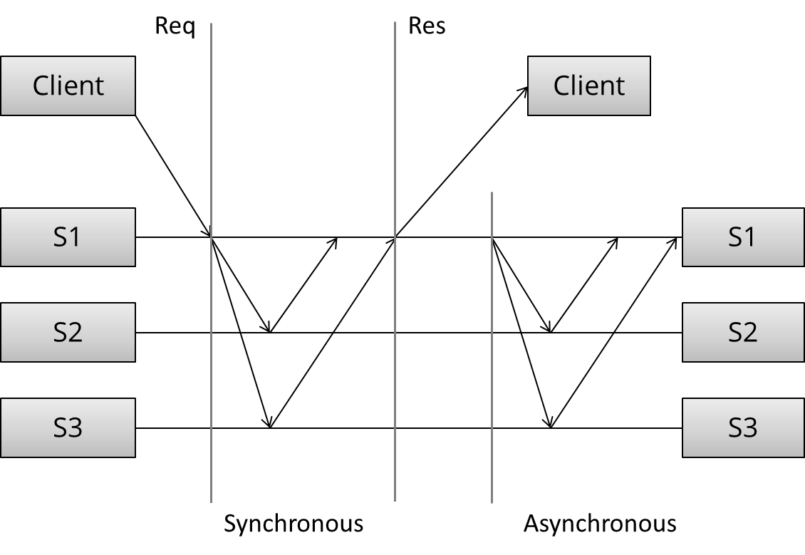

# 一致性问题

一致性问题是许多分布式系统的核心。我们希望分布式系统的可靠性和性能, 而不必处理分配所带来的后果 (例如, 节点之间的分歧), 解决一致性问题, 就可以解决几个相关的更高级的问题, 如原子广播和原子提交。

影响分布式系统设计选择的两个不可能结果(FLP和CAP):

- FLP不可能结果
    
    FLP论证了在一个异步的分布式系统中，即是只是容忍一个进程的错误，也不存在一个一致性算法可以保证正确性。这个结论听起来很可怕，连一个进程的错误都无法容忍，更何况通常对于多个进程的分布式系统，只是容忍一个进程的错误是不够的，然而实际上它只是论证了最坏的情况。首先它的前提是建立在一个完全异步的不可靠环境假设下，实际上可以让系统稍微“可靠”一些，其次，它只是论证了即使仅仅要容忍一个进程的错误，一致性算法都存在着永远不结束的可能。

    这种不可能的结果很重要, 因为它强调了假设异步系统模型导致权衡：当消息传递的边界不能保证时，处理一致性问题的算法必须放弃安全或活跃度。

- CAP原理

    * 一致性(Consistency)：所有节点在同一时间看到相同数据。
    * 可用性(Availability)：节点故障不能影响继续运行。
    * 分区容忍(Partition tolerance)：消息因为网络或节点故障丢失时系统继续运行。

    同时满足所有属性的系统是不可能实现的，最多同时满足两个:

    

    * CA(一致性+可用性)。需要非常严格的全体一致的协议，比如“两阶段提交”（2PC）。CA系统不允许网络错误或节点错误来保证一致性，一旦出现这样的问题，系统将自己变为只读状态确保可用性，但会拒绝所有新的写请求。
    * CP(一致性+分区容忍)。关注的是系统里大多数人的一致性协议，比如Paxos 算法。系统只需要保证大多数结点数据一致，少数节点在数据不同步时把自己的状态设为不可用。
    * AP(可用性+分区容忍)。允许数据存在多个副本，在不能达成一致时给出数据冲突，因此需要维护数据版本。

    当存在分区时，强一致性保证就要求我们放弃高可用。这是因为当两个分区间不能通信而继续在他们上面接收写操作时，不能避免副本间的差异。

    强一致性要求在执行每一个操作时都需要所有节点通信并达成一致。这导致高延时且影响性能。

一致性模型：

- 强一致性模型(维护单个副本)
    - 线性一致性: 所有的操作必须在一个全局实时系统中原子执行。
    - 顺序一致性: 所有的操作在各自节点上以某种顺序原子执行。

- 弱一致性模型
    - 以客户端为中心的一致性：涉及客户端或会话概念的一致性。比如，客户端为中心一致性保证客户端永远不会看到旧数据。这通常是通过增加缓存来实现的，这样当客户端访问到包含旧数据的副本节点时，返回的是缓存数据而非副本节点上的数据。
    - 因果一致性
    - 最终一致性: 如果停止修改值，经过一段时间后，所有副本会在相同的值上达成一致。这意味着在这段时间内副本间是不一致的。

# 时钟和顺序问题

- 全局时钟假设所有时间在所有分布式节点中完美同步。这样可以使用时间戳来确定全局时序。但可能变成一个潜在异常的来源:比如用户意外的改变了某节点的时间，或者一个过时的机器加入集群，或者时间同步的平率不一致，都会导致难以追踪的异常。

- 本地时钟假设每个节点都有自己的时钟。意味着你不能使用本地时钟来定义一个远端的时间戳是否发生在一个本地时间戳之前还是之后，也就是说，不能把来自不同节点的时间戳作比较。

- 无时钟只有逻辑时间的概念。我们不使用时钟, 而是以其他方式跟踪因果关系。时间戳只是在一个点上状态的简写，所以我们可以使用计数器和通信来定义某件事是否发生在另一件事之前、之后或同时发生。


时钟同步由网络延时和物理距离等因素影响，即使在多个节点间同步一个j简单的整数计数器也是一个挑战。虽然时间和顺序经常一起被讨论，但时间本身并不是很有用的属性。算法并不真正关心时间，而更多的是抽象的属性：1. 事件的因果顺讯；2. 故障检测(消息传递的上界值)；3. 一致的快照(在某个时间点系统的状态)。

时间/顺序/同步是否真的需要？这需要看情况。在某些用例中, 我们希望每个中间操作都要把系统从一个一致状态移动到另一个一致状态。例如, 在许多情况下, 我们希望数据库中的响应表示所有可用的信息, 我们希望避免处理系统返回不一致结果时可能发生的问题。

但在其他情况下，我们不需要那么多的时间/顺序/同步。例如，一个长时间运行的计算并且在结束前不真正关心系统所做的操作，那么只要保证答案正确就不需要太多的同步。


# 强一致性的复制问题

假设我们有一些初始数据库, 并且客户端发出请求以更改数据库的状态。可以分为以下几个阶段：
1. 请求。 客户端向服务端发送请求
2. 同步。发生同步复制
3. 响应。返回结果给客户端
4. 异步。发生异步复制




复制的基本方法分为同步和异步。从技术上分为单拷贝系统(防止分歧)和多主系统(有分歧风险)。

单拷贝系统的目的是“行为更像单系统”。当部分错误发生时，系统保证仅只有一份拷贝是有效的。而且系统保证复制总是一致的。主要的复制算法有：

- 主从复制(Master/Slave or Primary/Backup)

    所有的更新操作都在主上进行，操作日志(或变更日志)通过网络发送到备份副本上。这里有两个方法：同步复制和异步复制。同步复制要求两条消息("update" + "acknowledge receipt")，异步复制只需要一条update消息。

    任何异步复制算法都只能提供弱持久性保证。像Mysql的复制延迟：备份节点总是至少落后主节点一次数据更新。如果主节点出错，那些还没有发送到备份节点的更新操作会丢失。

    同步复制保证在返回客户端前，写操作已存储到备份节点中——以等待其他副本响应为代价。即使这样也只能提供弱保证：当主节点收到写请求并发送给从节点，从节点处理后并返回ACK，此时主节点在收到ACK前失败。如果出现这样的情况，只能手动的进行处理。

    为了防止这种异常情况，我们需要添加另外的消息，例如两阶段提交协议(2PC).

- 两阶段提交(2PC)

    两阶段提交的消息流如下所示：
    ```
    [ Coordinator ] -> OK to commit?     [ Peers ]
                    <- Yes / No
    [ Coordinator ] -> Commit / Rollback [ Peers ]
                    <- ACK
    ```

    第一阶段，协调者发送更新操作给所有的参与者。每个参与者执行更新并投票是否提交或终止。当投票提交，参与者要在临时区存储更新(预写记录)。在第二阶段完成前，更新被认为是临时的。

    第二阶段，协调者决定结果并通知每一个参与者。如果所有参与者都投票提交，更新被永久保存。

- 分区容忍算法

    网络分区是因为节点间因为网络问题而无法连接，但节点本身是活跃的，他们甚至可以收到客户端的请求。因此网络分区可能导致系统被分割为两个同时活动的分区。

    - 多数决定

        要求大多数节点，而不是全部节点(与2PC不同)投票同意更新。只要(N/2 + 1)个节点是正常的，那么系统就是可用的。当网络分区发生时，一个分区会包含大部分节点，而那些少数分区将停止处理写操作以防止分歧。

    - 角色

        每个节点有不同的角色。比如在Paxos算法中，有一个领导节点负责协调操作，其他节点负责接收。

    - Epochs


# 弱一致性算法

弱一致性算法允许副本间彼此存在分歧。这意味着没有严格定义的通信模式: 复制副本可以彼此分离, 但仍可继续使用并接受写入。例如这样的场景：

副本可能位于不同的数据中心中, 并且由于某种原因无法进行通信。每个副本在分区期间保持可用, 同时接受来自某组客户端的读取和写入。
```
[Clients]   - > [A]

--- Partition ---

[Clients]   - > [B]

--- Partition ---

[Clients]   - > [C]
```

一段时间后, 分区会愈合, 副本服务器开始交换信息。他们从不同的客户端收到了不同的更新, 彼此有分歧, 所以需要进行某种和解。我们希望发生的是, 所有的副本聚合到相同的结果。
```
[A] \
    --> [merge]
[B] /     |
          |
[C] ----[merge]---> result
```

- 冲突检测和读取修复

    许复制副本发散的系统必须有一种最终调和两个不同值的方法。一般的方法有

    - 最后一个编写器获胜。如果两个编写者同时写入, 则只保留最慢的作者的值。
    - 时间戳。名义上, 具有较大时间戳值的值获胜。但是, 如果时间不同步, 可能会发生许多奇怪的事情, 例如旧数据会覆盖较新的值。
    - 版本号。版本号可能会避免与使用时间戳相关的一些问题。请注意, 当有多个版本存在时，可以准确跟踪因果关系的最小机制是向量时钟, 而不是版本号。
    - 向量时钟。如图：
    
        

    读取值时, 客户端会联系N节点的R , 并向它们询问键的最新值。它接收所有的响应, 丢弃严格较旧的值 (使用向量时钟值来检测此)。如果只有一个唯一的向量时钟 + 值对, 它将返回。如果有多个矢量时钟 + 值对被同时编辑 (例如不可比较), 则返回所有这些值。

    从上面可以看出, 读取修复可能返回多个值。这意味着, 客户端/应用程序开发人员必须偶尔处理这些情况, 方法是根据某些用例特定条件选择一个值。

- 同步复制

    由于对节点故障和网络分区具有容错性，当更换或部分恢复故障节点时，需要一种方法来处理在分区后重新加入群集的节点。

    复制副本同步用于在发生故障后使节点更新, 并定期同步复制副本。

    Gossip是同步复制副本的一种概率技术。通信模式 (例如, 哪个节点联系哪个节点) 未事先确定。相反，节点有一定几率(p)尝试与其他节点同步。每隔t秒，每个节点选择另一个节点进行通信。

一致性保证薄弱的系统的另一种情况是一组客户端以某种顺序将消息发送到两个副本。因为没有强制执行单个总订单的协调协议, 所以消息可以以不同的顺序在两个副本中传递，即无序编程。

CRDT(convergent replicated datatypes)是一种数据结构, 用于提供始终收敛的数据类型, 只要它们看到相同的操作集 (按任意顺序)。


> 资料
- [分布式系统概览](http://book.mixu.net/distsys/single-page.html)
- [最终一致性模型数据的安全性和活跃性](http://www.bailis.org/blog/safety-and-liveness-eventual-consistency-is-not-safe/)
- [CRDTs](http://hal.archives-ouvertes.fr/docs/00/39/79/81/PDF/RR-6956.pdf)
