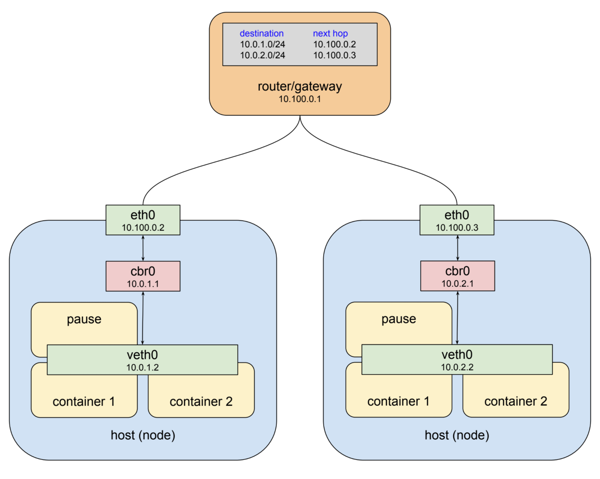

# Pod

Pods是kubernetes中最基本的单元。它是由一个或多个容器组成，并且共享网络堆栈和其他资源比如磁盘。“共享网络堆栈”是什么？实际上它表示pod中所有的容器可以用localhost相互访问。如果一个容器运行nginx并且监听80端口，另外一个容器运行scrapyd它可以使用http://localhost:80 来访问第一个容器。但是它是如何工作的？来看一个典型例子:


从上往下我们有一个物理网络接口eth0。链接eth0的是一个网桥docker0，虚拟网络接口veth0链接在网桥docker0上。docker0和veth0在相同的网段(172.17.0.0/24)。docker0是veth0的默认网关。容器运行时只能看见veth0并且通过docker0和eth0与外面通信。现在运行第二个容器：


第二个容器获得一个新的虚拟网络接口veth1，链接到相同的网桥docker0。这个接口分配的IP地址为172.17.0.3。两个容器可以通过docker0相互通信。

在kubernetes Pod中，容器之间为了共享网络堆栈，docker在启动容器时并不会创建一个新的虚拟接口，而是共享一个存在的接口：


现在第二个容器看见的是veth0而不是veth1。外部通过172.17.0.2寻址这两个容器，内部则通过端口找到具体是哪一个容器。这意味着两个容器不能打开相同的端口。这一套流程可以充分利用解耦和容器隔离，同时又可以让容器间的协作在最简单的网络环境中进行。

Kubernetes实现这种模式是通过为每个Pod创建一个特殊的容器，唯一的目的就是为其他容器提供网络接口。当Pod被调度后，在Node上使用docker ps命令，你会发现至少会有一个"pause"的容器。这个容器除了sleep不做任何事情直到收到SIGTERM信号而退出。尽管这个"pause"容器不活跃，但它是Pod的核心用来提供虚拟网络接口，所有其他容器用它来相互通信并且链接外部网络：


# The Pods Network

Kubernetes集群可以由多个节点组成，为了让不同节点上的Pod能相互通信，系统提供了两种方法：1. 分配一个全局的地址空间，每个节点上的网桥地址都属于这个空间并且是唯一的。2. 在网关上添加路由表，指定数据包如何被路由。虚拟网络接口、网桥、路由规则的组合被称为overlay network。



通常我们不需要手动添加路由表。当pod与另一个pod要通信时常常通过抽象的service来进行。

# services

Pod networking是很优雅的，但是它自己不足以创造一个稳定的系统。这是因为系统中pods的生命周期是短暂的。你可以使用pod的IP作为endpoint，但是当pod被重新创建时不能保证IP不会变化。

你可能意识到这是一个老问题，其标准的解决方案是：使用反向代理/负载均衡。客户端连接代理服务器，代理负责维护后端服务器健康状态并转发请求。这要求代理服务器是持久稳定的，并且必须有一个后端服务器列表，以及需要知道后端服务器的健康状态。Kubernetes中为满足这三个要求，定义了service的概念。

为了说明service是如何实现pod的负载均衡，我们使用deployment创建两个nginx的pods并暴露80端口

```yaml
kind: Deployment
metadata:
  name: nginx-deployment
spec:
  selector:
    matchLabels:
      app: nginx
  replicas: 2 # tells deployment to run 2 pods matching the template
  template: # create pods using pod definition in this template
    metadata:
      # unlike pod-nginx.yaml, the name is not included in the meta data as a unique name is
      # generated from the deployment name
      labels:
        app: nginx
    spec:
      containers:
      - name: nginx
        image: nginx:latest
        ports:
        - containerPort: 80
```
```shell
# kubectl apply -f deployment.yaml 
deployment.apps "nginx-deployment" created

# kubectl get pods -o wide
NAME                                READY     STATUS    RESTARTS   AGE       IP           NODE
nginx-deployment-64ff85b579-cpftn   1/1       Running   0          2h        10.244.2.9   192.168.118.218
nginx-deployment-64ff85b579-rbbmd   1/1       Running   0          2h        10.244.2.8   192.168.118.218
```
通过在其他节点增加路由表，我们就可以访问到这两个pod。但是如果pod被重启或调度到其他节点，IP会发生变化导致客户端连接中断。为了避免这种情况我们创建一个service。

```yaml
kind: Service
apiVersion: v1
metadata:
  name: my-service
spec:
  selector:
    app: nginx
  ports:
  - protocol: TCP
    port: 8080          # service
    targetPort: 80      # pod
```

```shell
清除iptables规则
# iptables -P INPUT ACCEPT
# iptables -P FORWARD ACCEPT
# iptables -F
# iptables -L -n

# kubectl describe service

Name:              my-service
Namespace:         default
Labels:            <none>
Annotations:       kubectl.kubernetes.io/last-applied-configuration={"apiVersion":"v1","kind":"Service","metadata":{"annotations":{},"name":"my-service","namespace":"default"},"spec":{"ports":[{"port":8080,"protocol":"T...
Selector:          app=nginx
Type:              ClusterIP
IP:                10.105.214.79
Port:              <unset>  8080/TCP
TargetPort:        80/TCP
Endpoints:         10.244.2.12:80,10.244.2.13:80
Session Affinity:  None
Events:            <none>
```

## Service Networking

每一个类型为ClusterIP的service都会被分配一个IP。它是servcie的默认类型，任何在集群中的pod都可以访问到。

像pod network一样service network也是虚拟的，但与pod不同的是：使用ifconfig命令查看，pod的ip地址是配置在实际的网卡上，而service的ip地址是完全虚拟的，它是路由规则配置而来。 kube-proxy的作用主要就是负责service的实现，具体来说，就是实现了内部从pod到service和外部的从node port向service的访问。

```shell
# iptables -S -t nat
-A KUBE-SEP-32JLQPNPQ4QBMKXF -s 10.244.2.13/32 -m comment --comment "default/my-service:" -j KUBE-MARK-MASQ
-A KUBE-SEP-32JLQPNPQ4QBMKXF -p tcp -m comment --comment "default/my-service:" -m tcp -j DNAT --to-destination 10.244.2.13:80
-A KUBE-SEP-JP7GPWZSV5GSOB6Q -s 10.244.2.12/32 -m comment --comment "default/my-service:" -j KUBE-MARK-MASQ
-A KUBE-SEP-JP7GPWZSV5GSOB6Q -p tcp -m comment --comment "default/my-service:" -m tcp -j DNAT --to-destination 10.244.2.12:80
-A KUBE-SERVICES ! -s 10.244.0.0/16 -d 10.106.86.116/32 -p tcp -m comment --comment "default/my-service: cluster IP" -m tcp --dport 8080 -j KUBE-MARK-MASQ
-A KUBE-SERVICES -d 10.106.86.116/32 -p tcp -m comment --comment "default/my-service: cluster IP" -m tcp --dport 8080 -j KUBE-SVC-KEAUNL7HVWWSEZA6
-A KUBE-SERVICES -m comment --comment "kubernetes service nodeports; NOTE: this must be the last rule in this chain" -m addrtype --dst-type LOCAL -j KUBE-NODEPORTS
-A KUBE-SVC-KEAUNL7HVWWSEZA6 -m comment --comment "default/my-service:" -m statistic --mode random --probability 0.50000000000 -j KUBE-SEP-JP7GPWZSV5GSOB6Q
-A KUBE-SVC-KEAUNL7HVWWSEZA6 -m comment --comment "default/my-service:" -j KUBE-SEP-32JLQPNPQ4QBMKXF
```
