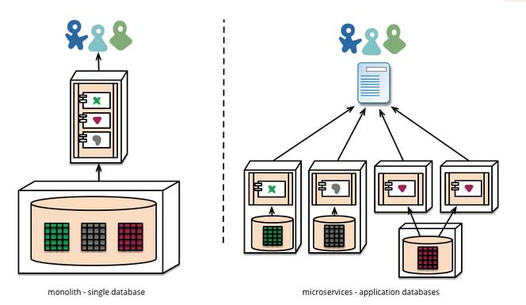

> 翻译 https://martinfowler.com/articles/microservices.html

# 微服务概念

”Microservices(微服务)“ - 是众多软件架构中的一个概念。尽管我们倾向于忽略这件事，但这些软件系统的概念描述还是让我们越来越感兴趣。我们已经看到最近这几年许多软件工程使用了这种模式，并且到目前结果邻人满意，正因为如此它已成为建立企业级应用的默认模式。不幸的是，现在还没有很多的关于microservice的概念以及应该怎样去实现。

简单的说，Microservices架构是一种把单体应用开发为一套小型服务的方法，每个服务运行在自己独立的进程中并用轻量级的机制进行通信，通常是HTTP API。这些服务围绕着业务能力来建立并且可以通过自动化部署工具进行独立部署。这里极少限度的对这些服务进行集中式管理，并且服务可能使用的是不同的编程语言或者不同的数据存储技术。

在开始解释Microservices前有必要与单体应用服务进行比较：单体应用建立成一个单元，企业级应用一般包括三部分：客户端用户界面(由运行在用户HTML页面和JS组成，并运行在用户端的浏览器上)，数据库，以及服务端应用。服务端应用接收HTTP请求并执行业务逻辑，从数据库获取和更新数据，选择和填充HTML页面并发送到客户端浏览器。服务端应用是一个庞大单一的逻辑执行程序，在系统中任何的改变都会触发编译和发布一个新的版本。

建立一个系统最自然的方式就是像这样拥有一个庞大的服务。所有处理请求的逻辑都运行在单个进程，允许你使用编程语言基本特性将应用分割成类、方法和名字空间。你可以通过负载均衡手段运行多个实例来横向扩展这个庞大的服务。

单体应用是非常成功的，但越来越多的人感觉受到挫折——特别是越来越多的应用发布在了云端。更改周期被绑在了一起——应用中任何小的改变，都要求整个庞大的系统重新编译和发布。长此以往很难保持好的模块化，也不利于扩展。

这些挫折导致出现了微服务架构：用多套服务构建应用。服务之间是独立可扩展的，每个服务规定了固定的模块边界，甚至允许不同的服务使用不同的编程语言，他们也可以由不同的团队来管理。

我们没有说过Microservices是革命性的，它的设计原理根源是从Unix而来。我们认为很少有人能够深入理解微服务架构并且软件工程师能够很好的使用它。

# 微服务特性

虽然没有正式的定义Microservices，但是我们可以尝试描述什么样的常用的架构特征适合这个标签。像这些常用的特征大纲，不是所有微服务架构都包含了所有的特征，但是我们真的希望更多的微服务架构展示出更多的特征。

## 1. 组件化的服务

在我们进入软件行业这么长的时间里，有一种渴望是用插件化的组建来建立系统，就像我们看到的真实世界一样。在最近的这20年中，我们看到了重大进展，大量常用的软件库成为许多语言平台的一部分。

当谈论组件时我们陷入了如何定义组件构成的困境中。我们是这样定义的：组件是一个软件单元可以独立的升级或替换。

微服务架构使用软件库，但是组件化我们软件的主要方式是分解服务。我们定义软件库，是被链接到工程中并在内存中直接调用其函数，但服务是进程外的组建，它通过某种机制，如web请求或远程调用进行通信。

使用服务而不是软件库作为服务的一个最主要原因是服务是独立部署的。如果你的应用在一个进程中由许多软件库构成，任何一个组件的变化都会导致整个应用重新部署。但是如果应用已经分解成多个服务，只需要将有变化的服务重新发布。这也不是绝对的，一些改变会涉及到对外接口的变化，但是好的微服务架构始终致力于最小化改变通过紧密结合的服务边界和通信机制。

另一个使用服务作为组件的原因是有更多的明确的服务接口。大部分语言没有好的机制定义明确的公共接口。通常阻止客户端破坏组件的封装，导致组件之间过度耦合。服务通过明确的远程调用机制很容易的避免这个问题。使用服务也有一些缺点:远程调用比进程内调用消耗更大。

## 2. 围绕业务能力

当拆分一个大的应用时，管理者通常关注的是技术层面，分为UI部门、服务端部门和数据部门。当一个团队被这样拆分，即使简单的修改都会导致跨部门，增加沟通成本。聪明的团队会优化这种模式，他们仅仅关注业务逻辑在哪个应用中。

微服务的划分则不同，它是围绕业务能力来的。这样的服务重叠的实现了业务，包括用户接口，持久化存储和其他外部协作。所以整个团队是跨职能的，需要开发人员有全面的技能：用户体验、数据存储和项目管理。

## 3. 产品而非项目

我们看到众多的应用开发努力使用项目模式：以交出一部分认为是完成了的软件为目的。软件开发完成后交给运维部门，项目组也就解散了。

微服务支持者希望避免这种模式，而用“团队拥有产品的整个生命周期”这种概念来代替。这个灵感来自于亚马逊提出的“你建立，你运行”的概念，开发团队对产品负责。这样带来的结果使开发人员注意到软件在产品中行为并且增加与用户的联系。

似乎没有理由单体应用不能达到相同的效果，但是更小力度的服务可以更容易的增进开发者与用户的关系。

## 4. 智能端点(endpoint)和哑管道

在建立不同进程之间的通信结构时, 我们看到了许多产品和方法, 它们强调通信机制本身需要智能化。这方面的一个很好的例子是企业服务总线 (ESB), 其中 ESB 通常是一个包含消息路由，编排、转换和应用业务规则的复杂设施。

微服务倾向于一种替代方法:智能端点和哑管道。以微服务建立的应用想要竟可能的解耦而又紧密联系——他们有自己的业务逻辑并且表现得像Unix系统中的过滤器——接收请求，执行逻辑，产生响应。服务间使用简单的RESTish协议而不是其他复杂的协议。

最常用的两种协议是 HTTP API和轻量级消息(RabbitMQ或ZeroMQ)。

在单体应用中，组件在进程中并且通过方法调用和函数调用进行通信。把一个单体应用变成微服务最大的问题在于改变通信模式。把内存中的方法调用变成RPC调用会导致冗余的通信而消耗性能。相反需要用粗粒度的通信替换细粒度通信。

## 5. 分权治理

集中化管理的后果是在单一平台上的标准化。但经验表明，这种方法是有限的——不是每个问题都是一个钉子而每个解决方法都是一个锤子。我们更喜欢用正确的工具来完成任务，但在集中式的应用中使用不同的编程语言，这并不常见。

与其在纸上定义标准，建立微服务的团队更喜欢开发有用的工具，其他开发者也可以用它解决相同的问题。这些工具通常从现实中收获并且和其他团队共享。

## 6. 分散的数据管理

数据管理权利下放以多种不同方式呈现。在最抽象层面上，意味着系统之间的概念模型是不同的。这是大型企业常见的问题：销售视图与技术支持视图不同，销售视图中被称为客户的东西根本不可能出现在技术支持视图中。还有一些属性表示不同的语义。

这个问题在应用之间是很常见的，但也肯能发生在内部应用中，特别是应用被划分为单独的组件时。一种有用的方法是边界上下文的领域驱动设计(Domain Driven Design)概念。DDD将一个复杂的领域划分为多个有界的上下文，并映射出他们的关系。这样服务之间也加强了间隔。

微服务还分散了数据存储决策。集中式应用使用一个单一的数据库来持久化数据，但微服务喜欢让每个服务管理自己的数据库，或者同一个存储技术的多个实例，或者不同的存储系统。

分散管理需要对跨服务的数据更新的影响负责。处理更新的常用方法是使用事物来保证更新多个资源时的一致性。

使用事物有助于保持一致性，但会导致大量的时间耦合，这在多个服务间是有问题的。分布式事物是很难实现的，因此微服务架构强调服务间的少事务协调，明确认为最终一致性通过补偿操作来处理。

选择这种方式管理不一致性对许多开发团队是一个挑战，但它常常与业务实践相匹配。通常业务处理某种程度的不一致是为了快速响应需求，同时有一些可逆流程来处理错误。只要修复错误的成本低于为保持一致性带来的业务损失就值得权衡。

## 7. 故障设计

使用服务作为组件的结果是应用需要设计容错机制以便忍受服务失败。任何服务调用都可能失败，客户端必须竟可能优雅的响应此问题。与集中式应用相比这是个缺点，因为它增加了复杂性。

由于服务可能在任何时候失败，因此很重要的一点是能够快速检测故障并在可能的情况下自动恢复。微服务应用非常重视对系统的实时监控，监控指标可以提供一个错误预警系统，触发开发团队跟进和调查。

> 资料
- 领域驱动设计：https://www.oschina.net/news/18245/what-is-domain-driven-design
- https://martinfowler.com/eaaDev/EventCollaboration.html